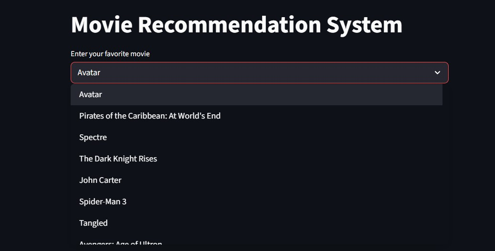
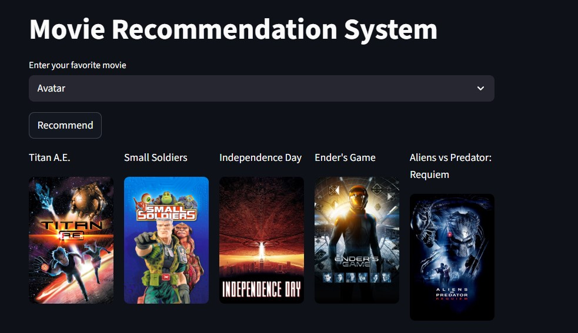

# Movie Recommendation System

A simple Streamlit app that recommends movies based on a precomputed similarity matrix and shows posters fetched from The Movie Database (TMDB).

✅ **Quick summary:** pick a movie from the dropdown and click **Recommend** to see 5 similar movie suggestions with posters.

---

## Features

- Fast content-based recommendations using a precomputed similarity matrix
- Poster fetching via TMDB API
- Minimal UI using Streamlit

---

## Prerequisites

- Python 3.10+ (3.8 may also work)
- Files required in the project root:
  - `movie_dict.pkl` (pickled movie metadata)
  - `similarity.pkl` (pickled similarity matrix)

---

## Installation

1. Create and activate a virtual environment (bash):

```bash
python -m venv .venv
source .venv/Scripts/activate    # On Windows Git Bash or bash.exe
# or for PowerShell: .\.venv\Scripts\Activate.ps1
```

2. Install dependencies:

```bash
pip install -r requirements.txt
```

---

## TMDB API Key

The app currently uses TMDB to fetch posters. The code contains a hardcoded key in `app.py`; for security and flexibility you should replace this with an environment variable.

Set your TMDB API key in your shell (bash):

```bash
export TMDB_API_KEY="your_api_key_here"
```

Then update `app.py` to read the key from the environment (recommended). If you want, I can make that change for you.

---

## Running the app

Start the Streamlit app:

```bash
streamlit run app.py
```

Open the URL shown in the console (usually http://localhost:8501).

---

## Usage

- Select a movie from the dropdown
- Click the **Recommend** button
- The app shows 5 recommended movie titles and their posters

---

## Troubleshooting

- If posters are missing or requests fail, verify your TMDB API key and internet connectivity
- If Streamlit fails to run, ensure you have the correct Python version and installed dependencies

---

## Screenshots 📸

If you have screenshots (for example `movie 0.jpg` and `movie 1.jpg` on your Desktop), place them in the repository so they can be displayed here.

Recommended location (avoid spaces in filenames): `assets/screenshots/`

Example embedded screenshots (these will display once the files are present):


_Movie 0 — Main UI showing recommendation controls_


_Movie 1 — Recommendations & posters_


If you'd like, I can also rename your images for you or add the files to the repo — upload them here or tell me how you'd like them named.

## Contributing

Contributions are welcome. If you send a PR, please:

1. Add tests for any new logic
2. Update the README if you add new features

---

## License

This repository is provided without a license. Add an open-source license (e.g., MIT) if you plan to share it publicly.

---

If you'd like, I can also:

- Replace the hardcoded TMDB API key in `app.py` with a secure environment variable lookup
- Add a `requirements.txt` (I added one next to this README)
- Add a small sample `movie_dict.pkl` / `similarity.pkl` or a script to create them

Feel free to tell me which of these you'd like me to do next.
